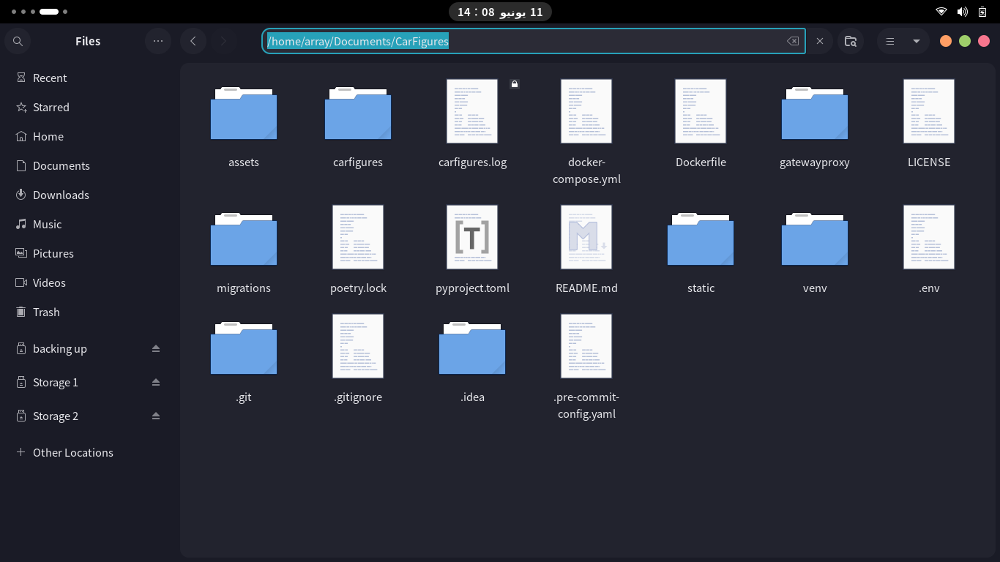
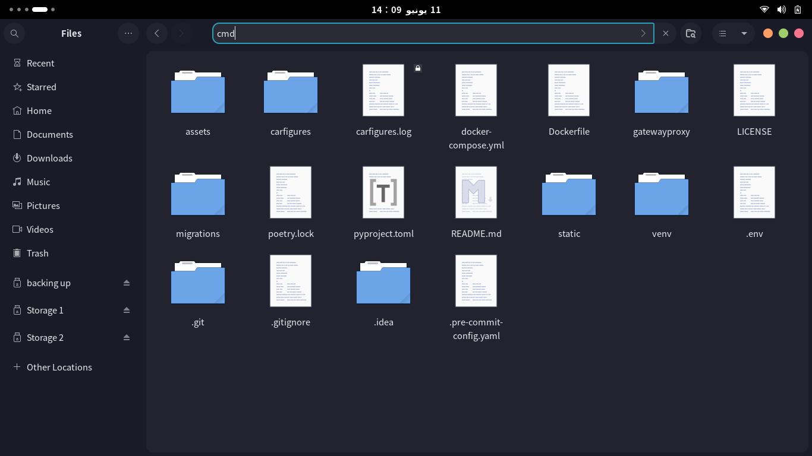

# CarFigures - The Better Alternative.

## About CarFigures

**CarFigures (The CF Project)** was born out of frustration with the BallsDex team's decisions. Initially, I had no particular liking for the idea; it was more about a response to dissatisfaction. The BallsDex team wasn't keen on implementing features that many of us wanted. I knew that merely complaining wouldn't lead to any change, as hundreds of others had already done so to no avail.

Determined to make a difference, I decided to take matters into my own hands. By forking BallsDex and applying my own changes and preferences, CarFigures came into existence.

CarFigures aims to address the community's frustrations and provide an alternative base to use and build their bots on. It's a project driven by a desire for improvement and a commitment to providing a better user experience.

## Installation
### Prerequisites

Before starting the installation, ensure you have the following tools installed:

- Git: Used for cloning the project and updating your bot to the latest versions. [Download Git](https://git-scm.com/downloads)
- Docker Desktop: Provides an easy way to run your bot in isolated containers. [Download Docker Desktop](https://www.docker.com/products/docker-desktop)
- Discord Bot Instance: Required to create and manage your bot on Discord. [Create a Discord Bot](https://discord.com/developers/applications)

> **Note:** If you are using Linux as your main desktop (like me) or hosting the bot on a Linux server, it is generally better to use [Docker Engine](https://docs.docker.com/engine/install).

### Installing
now since all this is done, let's start!

1. git clone the project using git like this. 
2. Download the settings.toml file [from here](https://drive.usercontent.google.com/download?id=1ZMm3zRS__UC7QOzGGN4ZyxmjnhLbp1sl&export=download&authuser=0) and drag it to your bot folder, now your bot folder should look something like this. 
3. Change the bot folder name from "CarFigures" to the name of your dex/figures bot to make it easier for you in docker to know which is what (very useful if working with multiple dexes/figures bots)

> **Note:** The settings.toml isn't updated by default when updating the bot files, you are required to check if any changes happened to the toml file by yourself, i will update the link of download every-time a new update for it gets released, its your responsibility.
 
## Post-Installation

Once you have completed the installation and configuration steps, its time to configure and make the bot look the way you like it to be!

### Configuration File

Remember the `settings.toml` file we just downloaded? Yep, that's the configuration file! In it, you will find a lot of settings you can change. This is part of CF's philosophy to make customizing your instance as easy as possible. For now, it's not much, but I'm planning for more soon! :3\
Read the comments I left in there to help you out!

Here’s a brief overview of the main configuration sections:

- **[settings]**: General bot settings, such as the bot token and command prefix.
- **[owners]**: Configuration for bot owners and co-owners.
- **[appearance.bot]**: Settings related to the bot's name and collectible name.
- **[appearance.interface]**: Customizable namings in the bot interface.
- **[appearance.commands.groups]**: Names of command groups.
- **[appearance.commands.names]**: Names of individual commands.
- **[appearance.commands.descs]**: Descriptions of individual commands.
- **[info.links]**: Links to various resources related to the bot.
- **[info.about]**: Information about the project and contributors.
- **[superuser]**: Settings for superuser commands.
- **[prometheus]**: Settings for Prometheus metrics collection.

### Starting up
after configuring and editing the settings.toml file, now its time to start the bot instance and play with it!

start by getting docker desktop up and running, then open your file explorer and head to the bot files 

#### for windows users
to access the command prompt pointed to this bot folder, go to the navigation bar and edit it (you can do that by click the empty part once) to type `cmd` or `powershell` then press enter, this will open a new command prompt instance that is pointed to the bot place

#### for macos/linux users
just cd to the place mate lmao, open a terminal and cd to the folder, if your bot folder is in the documents folder, usually you do `cd ~/Documents/(your bot folder name)`

after opening the terminal or command prompt, you shall be greeted with something like this (don't mind the toml thing, its git stuff)

now its time for you to build the project image (the image the contains your database which stores all your bot's progress, the code and more) using `docker compose build`

and now, its time to start up your bot!\
using `docker compose up` will make the docker starts all the containers and functions to start making connections to the discord's apis, allowing the bot to be alive!
and after doing it, the final results should be like this, with the end line saying "(your bot name) is now operational!"

That's it! You are all set to rock and roll with CarFigures!\
If you run into any trouble along the way, don't hesitate to reach out for help. We're here to make sure you have a smooth ride.

## Contributing to CarFigures!

Here's how you can jump in and help make this project even better:

### How to Contribute
There are several ways you can contribute to the CarFigures project:

1. **Open Issues:** Found a bug or have a feature request? Open an issue to let us know. This helps us identify and fix problems or consider new features.
2. **Help with Documentation:** Improve the documentation to make it easier for others to get started and understand the project. This includes tutorials, guides, and updating the README.
3. **Submit Pull Requests:** Fix bugs, add features, or improve existing code. See below for guidelines on how to submit a pull request.
4. **Provide Feedback:** Test the project and give feedback on your experience. This helps us understand what works well and what needs improvement.
5. **Spread the Word:** Share the project with others who might be interested in using or contributing to it.
6. **Join Discussions:** Participate in discussions on GitHub issues or the Discord server to help shape the future direction of the project.

#### Opening Issues

1. Go to the Issues section of the repository.
2. Click on the "New Issue" button.
3. Provide a clear and descriptive title for the issue.
4. Include detailed information in the body, such as steps to reproduce the bug or a detailed description of the feature request.

#### Helping with Documentation
1. Fork the repository to your GitHub account.
2. Create a new branch for your documentation changes: git checkout -b improve-docs
3. Make your changes and commit them with descriptive messages: git commit -m 'Improve documentation for installation process'
4. Push your changes to your branch: git push origin improve-docs
Open a pull request (PR) against the stable branch of the original repository.

#### Submitting Pull Requests
1. Fork the repository to your GitHub account.
2. Create a new branch for your feature or bug fix: git checkout -b new-feature
3. Make your changes and commit them with descriptive messages: git commit -m 'Add new feature'
4. Push your changes to your branch: git push origin new-feature
Open a pull request (PR) against the upstream branch of the original repository.

### Pull Request (PR) Guidelines

To make sure your PR can be checked out and merged smoothly, please follow these guidelines:

- Clearly describe the purpose of the PR and the changes made. This will make it easy for me to judge the PR. Usually, I don't refuse them, but more clarity = faster response.
- Provide tests and documentation for any new features or changes in functionality. This is good practice to always debug your code before pushing it.
- If possible, include screenshots showing before/after states of any visual changes. This can make it easier for me to review stuff, but I like reading changes too, so no worries on this part.
- Ensure that all existing tests pass without failure, i think i don't need to explain this.
- Make sure your code follows the project's coding standards and vibes, because off-vibe code makes it weird for me to look at, and I end up making it look like the rest of the codebase, so please save me some time lmao.
- Go with the least amount of line changes and commits as possible, this will be easier to track and validate, which allows me to review it fast and give small comments if necessary.

### Code of Conduct

I'm all about creating a welcoming and chill community.
Everyone who contributes is expected to stick to the [Code of Conduct](./assets/CODE_OF_CONDUCT.md) when getting involved with the project and its community members.

### Help and Feedback

If you need help, have questions, or want to share your thoughts, don't hesitate to open an issue or ask about it in the dev category inside the CarFigures Discord server.\
I'm here to support you every step of the way.

I'm stoked about every contribution from the community. Let's join forces and make the project even more rad!\

> **Note:** For access to the dev category on the CarFigures Discord server, inform me that you are making a bot using CF, and I will assign you the forker role.

## Roadmap and Future Plans
I'm excited about the future of the project and all the bots that uses it! Here are some features and improvements I have planned:

### Upcoming Features

- Economy and Modifying Packages.
- Server/Player Settings Embed
- Leaderboard Embed + Controls
- Crafting Commands | Customizable Through The Admin Panel
- Racing/Battling Package

### Future Plans

- Switch from fastapi_admin to our own tech-stack.
- Implement a premium plan inside CF.
- Combine some existing commands into one (e.g., /user privacy and /user donation policy into /user settings)

## Final Thoughts

I am incredibly grateful to everyone who contributes to The CF Project. Whether you provide code, suggest features, report bugs, or offer emotional support, your efforts are deeply appreciated. Knowing that I am not alone in this project and having a supportive community means the world to me.

Thank you all from the bottom of my heart ❤️ (especially you, Peri :] ❤️).

Let's continue to make the project an awesome and valuable project for everyone!

